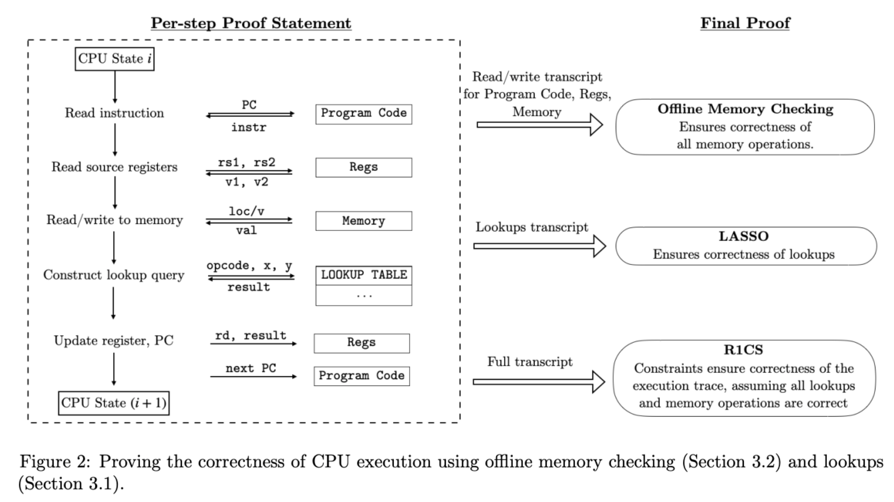
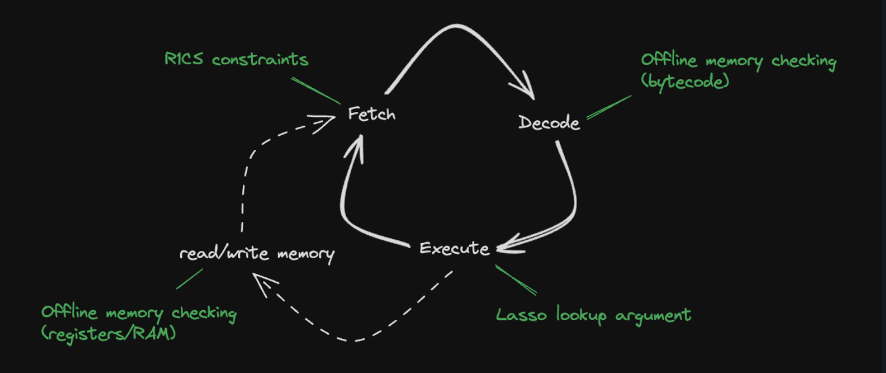

## 1. Background

[Jolt](https://jolt.a16zcrypto.com/intro.html) 是由 A16Z 的密码学家们提出的一个针对 Risc-V ISA （未来将支持更多ISA）的 zkVM 框架，它底层使用了 sumcheck-based SNARK，这个 SNARK 充分利用多变量多项式及其多项式承诺的优势。Jolt zkVM 据说拥有非常出色的性能表现并且还存在优化空间。

首先需要了解 Jolt zkVM 架构，分为 4 个组件。一个 Virtual Machine（VM）实质上是做两个事情：
- 重复地执行“取指-译码-执行“逻辑（也叫 instruction cycle）。指令由 ISA 定义
- 读写 RAM
 


结合 Jolt 论文中的图示，可以看到：CPU 从一个状态 $state_i$，（结合 PC）从storage 中读取程序代码的指令，读取源寄存器的值甚至读写 memory，然后通过 lookup query 译码执行返回结果，最终把结果写到目的寄存器，更新到CPU状态为 $CPU_{i+1}$ 。

其中：
- 读写 storage，regs，memory 中的数据需要用到 offline memory checking.
- 译码执行需要使用 lasso
- 前两者生成的约束表示为 R1CS 形式，然后证明。

在 Jolt 代码实现中，把 storage 中存放的字节码指令（只读） 与 regs 和 memory 中存放的数据（可读写） 分离开，因而构成了四大组件。



- 字节码：也就是程序指令，使用 read-only memory checking argument 证明
- 读写内存：使用 memory checking argument 去证明读写内存的正确性。对于 register，Jolt 将其实现为在特殊地址的内存。
- 指令查询：在执行指令时，使用一种名为 Lasso 的 lookup argument 证明
- R1CS：以上所有的 instruction cycle 都需要满足 R1CS 约束。它作为一种粘合剂，可以为跨组件的数据施加约束。

Jolt zkVM 的使用与 RISC0 的 zkVM 类似，都是使用 guest program 来表示欲证明的 computation，host program 则是运行 zkVM 的程序，通过 host program 我们可以利用 jolt_sdk 来为 guest program 的正确运行生成证明，guest program 的输入也是在 host program 中构造并传递的。

## 2. Puzzle Description

> [Attachments](https://github.com/fibonhack/MOCA-2024-finals-challs/raw/refs/heads/main/crypto/two_plus_two/two_plus_two.zip)

内容如下：

```
.
├── Dockerfile
├── diff.patch
├── jolt
├── readme.txt
└── server
```

先看 readme：

```
# Author: @gio-d3141
# Dockerfile should build fine (will take a while) but the setup is kind of cursed, DM me if necessary

git clone git@github.com:a16z/jolt.git
cd jolt

# just the latest commit at time of writing
git checkout 0cc7aa31981ff8503fe256706d2aa9c320abd1cd
git apply ../diff.patch
```

这个题 clone 了 jolt 库，并打了一个 patch，补丁内容如下：

```
diff --git a/jolt-core/src/r1cs/jolt_constraints.rs b/jolt-core/src/r1cs/jolt_constraints.rs
index 5fb0d871..295dce32 100644
--- a/jolt-core/src/r1cs/jolt_constraints.rs
+++ b/jolt-core/src/r1cs/jolt_constraints.rs
@@ -289,13 +289,8 @@ impl<F: JoltField> R1CSConstraintBuilder<F> for UniformJoltConstraints {
 
         // if (rd != 0 && update_rd_with_lookup_output == 1) constrain(rd_val == LookupOutput)
         // if (rd != 0 && is_jump_instr == 1) constrain(rd_val == 4 * PC)
-        let rd_nonzero_and_lookup_to_rd =
+        let _rd_nonzero_and_lookup_to_rd =
             cs.allocate_prod(JoltIn::Bytecode_RD, JoltIn::OpFlags_LookupOutToRd);
-        cs.constrain_eq_conditional(
-            rd_nonzero_and_lookup_to_rd,
-            JoltIn::RD_Write,
-            JoltIn::LookupOutput,
-        );
         let rd_nonzero_and_jmp = cs.allocate_prod(JoltIn::Bytecode_RD, JoltIn::OpFlags_IsJmp);
         let lhs = JoltIn::Bytecode_ELFAddress + (PC_START_ADDRESS - PC_NOOP_SHIFT);
         let rhs = JoltIn::RD_Write;
```

它变动了 `rd_nonzero_and_lookup_to_rd` 的内容，具体是删除了：

```
-        cs.constrain_eq_conditional(
-            rd_nonzero_and_lookup_to_rd,
-            JoltIn::RD_Write,
-            JoltIn::LookupOutput,
-        );
```

git 很好地帮我们定位到了所修改的文件 `jolt/src/r1cs/jolt_constraints.rs` 第 292 行。

附件还给出了 host 中要运行的 guest 程序代码：

```rust
#![cfg_attr(feature = "guest", no_std)]
#![no_main]

#[jolt::provable]
fn two_plus_two() -> u16 {
    let mut n: u16 = 2;

    #[cfg(any(target_arch = "riscv32", target_arch = "riscv64"))]
    unsafe {
        core::arch::asm!(
            "li {n}, 2",
            "add {n}, {n}, {n}",
            n = inout(reg) n,
        );
    }

    #[cfg(target_arch = "x86_64")]
    unsafe {
        core::arch::asm!(
            "mov {n}, 2",
            "add {n}, {n}, {n}",
            n = inout(reg) n,
        );
    }
    n
}
```

出题人的意图应该在于利用修改之后的 jolt 库来证明 2 + 2 = 5.

## 3. Alynasis

我们需要深入理解 jolt zkVM 的 [R1CS 设计](https://jolt.a16zcrypto.com/how/r1cs_constraints.html)。

jolt 的 R1CS 部分是通用的组件，意味着它适用于每一个 CPU step （也就是“取指-译码-执行”的 instruction cycle），每一个 step 只需要接近 60 个约束和 80 个变量。

每一个 CPU step 需要的输入有：

- 字节码相关（只读）：
  - bytecode read address: 这一步中所需要取出的指令的 idx
  - 预处理之后的指令表示：`(elf_address, bitflags, rs1, rs2, rd, imm)`
- 读写内存相关：
  - 指令所需要读写的内存地址，如果不是一个 load/store 指令，则置 0.
  - 内存中读写的字节
- 指令 lookup（执行）相关：
  - 指令操作数 `x` 和 `y` 的 chunks
  - lookup query. 一般是操作数的结合
  - lookup output.

单看 patch 所修改的那个变量名，可知：它约束了 rd（目的寄存器）非 0 且 rd 的值与 lookup 的 output 相等。从上面的注释也解释了这一点：

```
 // if (rd != 0 && update_rd_with_lookup_output == 1) constrain(rd_val == LookupOutput)

 ...
 cs.constrain_eq_conditional(
    rd_nonzero_and_lookup_to_rd,
    JoltIn::RD_Write,
    JoltIn::LookupOutput,
);
...
```

`cs.constrain_eq_conditional` 目的是当第一个参数为 1，则第二、三个参数必须向灯。`JoltIn::RD_Write` 这个值来自于读写内存模块，表示写入目的寄存器的值，`JoltIn::LookupOutput` 这个值来自指令执行模块，表示指令 lookup 查询后返回的结果。

因此，当补丁删除了这条约束后，zkVM将不再检查 rd 的输出与 lookup 的一致性，因此导致漏洞。也因此我们可以得到 `2 + 2 = 5` 的证明。

## 4. EXP

在写代码之前，我们应该梳理一下我们需要做哪些事情：

1. 修改加法指令的逻辑，使得 `2 + 2 = 5`
2. 调用 jolt_sdk 生成 proof

对于第一点，我们需要修改 `jolt/tracer/src/emulator/cpu.rs`。这是 jolt 的 tracer 模块，用于模拟 CPU 生成 execution trace。

```rust
    Instruction {
        mask: 0xfe00707f,
        data: 0x00000033,
        name: "ADD",
        operation: |cpu, word, _address| {
            let f = parse_format_r(word);
            cpu.x[f.rd] = cpu.sign_extend(cpu.x[f.rs1].wrapping_add(cpu.x[f.rs2] + 1));
            Ok(())
        },
        disassemble: dump_format_r,
        trace: Some(trace_r),
    },
```

如上，我把其中一个源寄存器加 1，即可得到 `2 + 2 = 5`。（只要能够使得 2+2=5逻辑成立都可）。

在 host program 中打印 output 并生成 proof 即可。

完整代码：见 [code](https://github.com/Xor0v0/ZK-Puzzle-Writeups/tree/main/docs/crypto/2+2=5/code) 文件夹.

