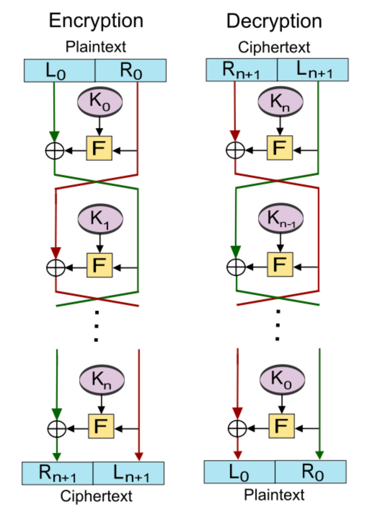

## Day 1

Puzzles: https://github.com/scalebit/zkCTF-day1

### Kid Math

We need to implement a Fibonacci  Chip using [Halo2](https://zcash.github.io/halo2/) and pass the given test cases.

Note that the `pb` in the first row is given (`pb = 127`) and `pa` in next rows is also given (`pa = 125`). So all we need to do is to construct appropriate constraint relationships using the existing conditions mentioned above, So everyone's answer may be different.

My constraint is : `-a * pa + b * pb - c - pc == 0`, where `pa = 125, pb = 127, pc = 126`. and the output is `134`.

### Division Quiz

Another Halo2 puzzle involves lookup table and it requires us to constrain DIV operation, where the dividend is within a certain range.

2 constraint have to satisfy:

1. dividend = divisor * quiotient + reminder
2. reminder < divisor

For the first constraint, we can achieve it using a custom gate. For the second constraint, either use a lookup range proofs or use a addtion gate `b = r + k`. In addition, we should check all of these value `a, b, c, r, k` are in certain bits range, e.g [0, 1 << 128] for u128 division.

### Roundabout

The `Roundabout.circom` uses MiMCSponge template to generate hash, and the puzzle part lies in:

```
template Gift () {
    signal input a;
    signal input b;
    signal c;
    signal b_sq;
    signal c_sq;
    signal output d;
    
    component m = MiMCSponge(1,2,1);
    m.ins[0] <== a;
    m.k <== 1;
    c <== m.outs[0];
    c === 3066844496547985532785966973086993824;

    b_sq <== b * b;
    c_sq <== c * c;
    
    assert(b_sq < 999999999);

    9 * b_sq + 37622140664026667386099315436167897444086165906536960040182069717656571868 === c_sq * b_sq; 

    d <== b * a;
}
```

To solve the puzzle, we need to reverse the template input `a, b` and output the expected `d`.

{ .center width=40% }

Note that the MiMCSponge hasher is initialized as `component m = MiMCSponge(1,2,1);`, which means that it takes in one input and output a result. And it will run only two rounds of Feistel network internally. As a result:

$$
xL_{in}=a \\
xR_{in}=0 \\
k = 1\\
t = k+xL_{in}=1+a \\
t2 = t^2=(1+a)^2 \\ 
t4={t2}^2=(1+a^4) \\
xL_0 = xR_{in} + t4 * t=(1+a)^5 \\
xR_1 = xL_{in} = a
$$

`S[0].xL_{out}=(1+a)^5=3066844496547985532785966973086993824`, so `a=19830713` and b can be easily compute `b=2`.

If one doesn't know about feistel construction, it can simply try some inputs and observe the output of `MiMCSponge(1, 2, 1)` is increasing. Then it can use binary search to try and get the input.


### Ethereal

#### Description

Welcome to Ethereal. Here, your quest is to forge the Seed Blade, a powerful sword assembled from 10 mystical parts. With each part, your blade becomes stronger, symbolizing your growing cryptographic mastery.

Your challenge: to mint Gems with this blade. 
Mint 10 gems, and you demonstrate your skill and balance. 
Mint 20, and you push the boundaries of your abilities. But beware, each gem brings both power and peril. Will your Seed Blade be a tool of wisdom or lead to your downfall? The path is yours to choose.

#### Analysis

We are given a `mint-client` directory  which generated by [abigen](https://geth.ethereum.org/docs/tools/abigen) to help us interact with smart contracts, and a `mint-contracts` directory containinig smart contract source code.

First of all, we look into the contract part. The most important part is the Mint contract in `mint-contracts/src/MinGem.sol` which defines the main logic of the puzzle.

<details>
<summary><font color=MediumAquamarine>Check contract source code 👀</font></summary>

```solidity
contract Mint is Verifier {
    struct DepositInfo {
        bool registered;
        uint256 nonce;
        Pairing.G1Point commitment;
        Pairing.G1Point soulBox;
        uint256[] collectedY;
        bool escaped0;
        bool escaped1;
    }

    // function is_sovled(DepositInfo info) returns (bool) {
    //     if(DepositInfo.escaped0 && DepositInfo escaped1)
    //     {return true;}
    //     else
    //     {return false;}
    // }
    

    function getCollectedY(address user) public view returns (uint256[] memory) {
        return deposits[user].collectedY;
    }

    mapping(address => DepositInfo) public deposits;
    event Deposit(Pairing.G1Point indexed soulbox, Pairing.G1Point commitment,uint256 timestamp);
    event Minted(address indexed user, uint256 nonce);
    event Pwned(uint256 indexed privateKey);

    function register(
        Pairing.G1Point calldata _commitment, 
        Pairing.G1Point calldata _proof, 
        Pairing.G1Point calldata _soulBox
        ) external payable {
        address sender = msg.sender;
        require(!deposits[sender].registered, "User registered");
        require(verifySoulBox(_commitment, _proof, _soulBox), "Invalid  soul box proof");
        deposits[sender] = DepositInfo({
            registered: true, 
            nonce: 1, 
            commitment: _commitment,
            soulBox: _soulBox,
            collectedY: new uint256[](0),
            escaped0: false,
            escaped1: false
        });
        emit Deposit(_soulBox, _commitment, block.timestamp);
    }

    function getNonce(address _user) public view returns (uint256) {
        return deposits[_user].nonce;
    }

    function mint(
        Pairing.G1Point calldata _proof, 
        uint256 _value
    ) external {
        address sender = msg.sender;
        uint256 nonce = getNonce(sender);
        require(deposits[sender].registered, "User registered");
        require(verify(deposits[sender].commitment, _proof, nonce, _value), "Invalid mint proof");
        deposits[sender].collectedY.push(_value);

        uint256[] memory xArray = new uint256[](nonce);
        for (uint256 i = 0; i < nonce; i++) {
            xArray[i] = i+1;
        }
        uint256[] memory wArray = getBarycentricWeights(xArray);
        // recover private_key = f(0) by lagrange interpolation
        uint256 soul = evaluateBarycentricPolynomial(0, deposits[sender].collectedY, wArray);
        Pairing.G1Point memory soulBox = Pairing.mulScalar(SRS_G1_0, soul);
        require(soulBox.X != deposits[sender].soulBox.X, "Soul dispersed");
        
        if(nonce == 10){
            deposits[sender].escaped0 = true;
        }
        if(nonce == 20){
            deposits[sender].escaped1 = true;
        }
        
        emit Minted(sender, deposits[sender].nonce);
        deposits[sender].nonce += 1;
    }

    function replay() external {
        address sender = msg.sender;
        require(deposits[sender].registered, "User not registered");
        delete(deposits[sender]);
        delete(deposits[sender].collectedY);
    }
}
```
</details>

The register function takes in 3 inputs: a KZG cimmitment `_commitment` of polynomial, a opening proof `_proof` of corresponding polynomial and a publicKey `_soulBox`. The 3 stuffs can be generate by `CraftBladeSignature` in `mint-client/blacksmith.go` and it is actually a KZG opening proof of a sword polynomial which is generated by random and stored in the `sword.json` at index `0`. So the privateKey is actually the first number of `sword.json`.

Note that `verifySoulBox` method will verify the KZG openning proof of index 0.

we can check it by running:

```bash
go run . -contract 0x5fbdb2315678afecb367f032d93f642f64180aa3 -action register
# (*big.Int)(0xc000126000)(7387512810814433601023902593855093598498966062809372162954534333509796980828)
# (*bn254.G1Affine)(0xc000128040)(E([4663152887034778978712025808205539272224485928059866901645348175989267801382,7337163707989781172140860281787651571090746340470207475573012821654567505278]))
```

When we mint gems, we should provide a opening proof of sword poly at the index of `nonce`. Note that the nonce of user's desposit information in the contract is initialized by 1. The contract will verify the opening proof and further the Mint contract is trying to recover the privateKey f(0) of the sword poly, minting will fail if it is recovered successfully.

In order to solve this puzzle, we need to mint 20 gems. However, according to the SRS given in the `Constant.sol`, we can only generate 16 openning proof at most (the first one is the privateKey (soul) so that we can not use it to produce a opening proof).

Obviously, the size of SRS is limited and this is acttually a Rate Limitinmg Nullifier (RLN) protocol on the KZG version. The security of the protocol guaranteed by the **polynomial interpolation theorem**.

There are two ways to solve the problem:

1. Can we recover the trapdoor of the SRS so that we can add the length of SRS and forge a polynomial of degree > 20?
2. Is the protocol has some vulnerability to allow us forge proofs that these points do not lie on the polynomial of degree 16, like malleable attack?

Both methods are feasible.

For #Method 1, by googling the `SRS_G1_X=0x2f588cffe99db877a4434b598ab28f81e0522910ea52b45f0adaa772b2d5d352`, we can find this [repo](https://github.com/matter-labs/era-compiler-tests/blob/9a8c6d99d84cec7343e79a28b2a6df49aef57796/yul/precompiles/ecmul_source.yul#L68-L82). It leaked the trapdoor value: `115792089237316195423570985008687907853269984665640564039457584007913129639935`. I think this is an unexpected solution :)

For #Method 2, this [article](https://hackmd.io/@n1trox/SJlFMYlr2) introduces the attack vector to forge kzg opening proofs without knowing the trapdoor value.

In detail, we notice that `KZGVerifier.verifySoulBox` checks the pairing equation when $u=0$:

$$
e(g^{f(\tau)-f(u)},g)\overset{?}=e(g^{h(\tau)},g^{(\tau-u)})
$$

Normally, we should input $f(u)$ (specifically `_value` or `soul`), $u$ (specifically `_index`) and $h(\tau)$ (sepecifically `_proof`). In order to reduce the amounts of $\mathbb{G}_2$ element, we perform the following transformation:

$$
e(g^{f(\tau)-f(u)},g)\overset{?}= e(g^{h(\tau)},g^{(\tau-u)}) \\
\Rightarrow e(g^{f(\tau)-f(u)},g)\cdot e(g,g)^{-h(\tau)\cdot(\tau-u))}\overset{?}=1\\
\Rightarrow e(g^{f(\tau)-f(u)},g)^{u\cdot h(\tau)}\cdot e(g,g)^{-h(\tau)\cdot \tau}\overset{?}=1\\
\Rightarrow e(g^{u\cdot h(\tau)+f(\tau)-f(u)},g)\cdot e(g^{-h(\tau)},g^\tau)\overset{?}=1
$$

That is the code implementation corresponding to the puzzle. When $u=0$, we can use the attack vector to forge arbitary proofs.

1. select a random field element $\gamma$;
2. construct the new value $nv = g^{f(0)-\gamma\tau}$ and new proof $nf=g^{h(\tau)+\gamma}$

Let us verify its correctness:

$$
e(g^{f(\tau)-f(0)},g)\cdot e(g^{-h(\tau)},g^\tau)\overset{?}=1\\
\Rightarrow e(g^{f(\tau)-(f(0)-\gamma\tau)},g)\cdot e(g^{-(h(\tau)+\gamma)},g^\tau)\overset{?}=1
$$

Then the polynomial equation is:

$$
f(\tau)-(f(0)-\gamma\tau)=(h(\tau)+\gamma)\cdot\tau\\
\Rightarrow f(\tau)-f(0)+\gamma\tau=h(\tau)\tau+\gamma\tau\\
\Rightarrow f(\tau)-f(0)=h(\tau)\tau\\
$$

Correct!

Therefore, we can register with the fake opening proof generated by the existing soulBox and its opening proof. Tee contract will pass the register process and then it can no longer recover the privateKey f(0) because the fake soulBox is a point that does not lie on the polynomial of degree 16 and the protocol loses efficacy.

#### EXP

```
case "forge":
		// 1. load sword info
		var sword []fr.Element
		f, err := os.Open("sword.json")
		panicErr(err)
		defer f.Close()
		decoder := json.NewDecoder(f)
		err = decoder.Decode(&sword)
		panicErr(err)

		// 2. forge
		bladeCommitment, bladeProof := CraftBladeSignature(sword, SRS)
		commitmentPoint := G1AffineToG1Point(&bladeCommitment)
		// forge the fake bladeProof
		var fakeProof bn254.G1Affine
		fakeProof.ScalarMultiplication(&SRS.Pk.G1[0], big.NewInt(114514)) // g^{114514})
		spew.Dump(fakeProof)
		fakeProof.Add(&fakeProof, &bladeProof.H)
		spew.Dump(fakeProof)
		bladeProofPoint := G1AffineToG1Point(&fakeProof)
		spew.Dump(bladeProofPoint)

		var fakeSoulBox bn254.G1Affine
		fakeSoulBox.ScalarMultiplication(&SRS.Pk.G1[1], big.NewInt(114514)) // g^{\tau * 114514})
		fakeSoulBox.Sub(&bladeProof.PublicKeyG1Aff, &fakeSoulBox)
		soulBox := G1AffineToG1Point(&fakeSoulBox)

		// 3. register
		mintContract.Register(transactor, *commitmentPoint, *bladeProofPoint, *soulBox)
	}
```

After register, when can mint as much as we want!

## Day 2

Puzzles: https://github.com/scalebit/zkCTF-day2

### Is Zero

This is a simple is_zero circuit implement. According to the test case, we know that the input arrays `a, b` are the input and result respectively.

The 3 advice columns are repectively a, a_inv and b. Then We configure and asssign them.

### Mixer

We are required to drain the immutable contract Mixer.

The implementation is quiet similar with the [Tornado Cash](https://www.rareskills.io/post/how-does-tornado-cash-work) protocol. One can deposit 1 ether with a commitment (usually a hash of some secret value), then withdraw by providing the corresponding proof that the secret value can be exactly used to generate the commitment. [Nullifier](https://hackmd.io/@liangcc/nullifier) is a clever mechinism that make sure  a message only takes effect once. It is the nullifiers keep the protocol from suffering double-spending attack and nullifiers have something to do with the secret value so that verifier can check the prover indeed owns the secret value to generate the corresponding commitment.

When it comes to draining a tornado cash protocol, the first possibility that comes to my mind is if we can forge the nullifiers. One should always pay attention to the field operation in the zk application and always check the input data validation.

According to the code given in the `Verifier.sol`, we notice the finite field that protocol works on is $\mathbb{F}_p$, where $p=21888242871839275222246405745257275088548364400416034343698204186575808495617$, known as the modulus of bn254 curve. But uint256 in solidity can represent a number of 256 bits, so it remains a huge space for hackers to forge nullifiers. Therefore, protocol has to check that the range of nullifier is strictly within finite field. However, it does not.

So we can repeatly withdraw funds with the same proof and commitment using as many as nullifiers we want by adding `p` repeatly, until the contract drains.

### Familiar Strangers

#### Description

In the realm of the familiar, where logic gates are the silent sentinels of truth, lies a challenge shrouded in enigma. "Familiar Strangers" beckons you to a world where the simplest of circuits hide secrets just beyond the veil of obviousness. These circuits, reminiscent of the ones you've met countless times, now hold a mystery that only a true Circom savant can unravel. Two levels, each a step deeper into the cryptic dance of numbers and logic, await your prowess. Are you ready to discover the true inputs and reveal the concealed answers within? Find the key, communicate with our judge service, and claim your place among the elite who see beyond the familiar to the truth that lies beneath.

#### Analysis

We are given 2 circom circuits (respectively level1 and level2) and required to reveal the inputs.

```circom
template Level1() {
    signal input in;
    signal output out;
    out <== 1;
    component lt = LessThan(201);
    lt.in[0] <== in;
    lt.in[1] <== 6026017665971213533282357846279359759458261226685473132380160;
    lt.out === out;
    component gt = GreaterThan(201);
    gt.in[0] <== in;
    gt.in[1] <== -401734511064747568885490523085290650630550748445698208825344;
    gt.out === out;
}
```

Level1 circuit constrains the `out` signal to 1, and the `in` signal less than `6026017665971213533282357846279359759458261226685473132380160` and greater than `-401734511064747568885490523085290650630550748445698208825344`. Note that the input is **expected** to be a number with 201 bits but `LessThan` and `GreaterThan` template never checks it is within the valid range. This attack vector is well explained [here](https://github.com/0xPARC/zk-bug-tracker?tab=readme-ov-file#4-mismatching-bit-lengths)

To pass the circuit, we only need to find a number whose 202th bit is 0 within [0, 2**201).

```python
6026017665971213533282357846279359759458261226685473132380160 % 2**n
# 2812141577453232982198433661597034554413855239119887461777408
-401734511064747568885490523085290650630550748445698208825344 % 2**n
# 2812141577453232982198433661597034554413855239119887461777408
```

Do the same operation with level2 circuit:

```python
3533700027045102098369050084895387317199177651876580346993442643999981568 % (1<<241)
# 5897488333439202455083409550285544209858125342430750230241414742016
-3618502782768642773547390826438087570129142810943142283802299270005870559232 % (1<<251)
# 5897488333439202455083409550285544209858125342430750230241414742016
```

Note that we need to constrain the length of input of level2 circuit to be great and equal than 70. We can make use of the characteristics of field operations again, which is known as input alias issue. 

```
input_of_level2 = 5897488333439202455083409550285544209858125342430750230241414742016 + p
```

Because this is just a check in javascript, we can simply add some leading-zero before the input, saying `00005897488333439202455083409550285544209858125342430750230241414742016` to bypass this check.

### What a Waste

We are given a Round 2 seed random value but nothing else and required to forge a proof.

Emmm... Try to figure it out next time.
